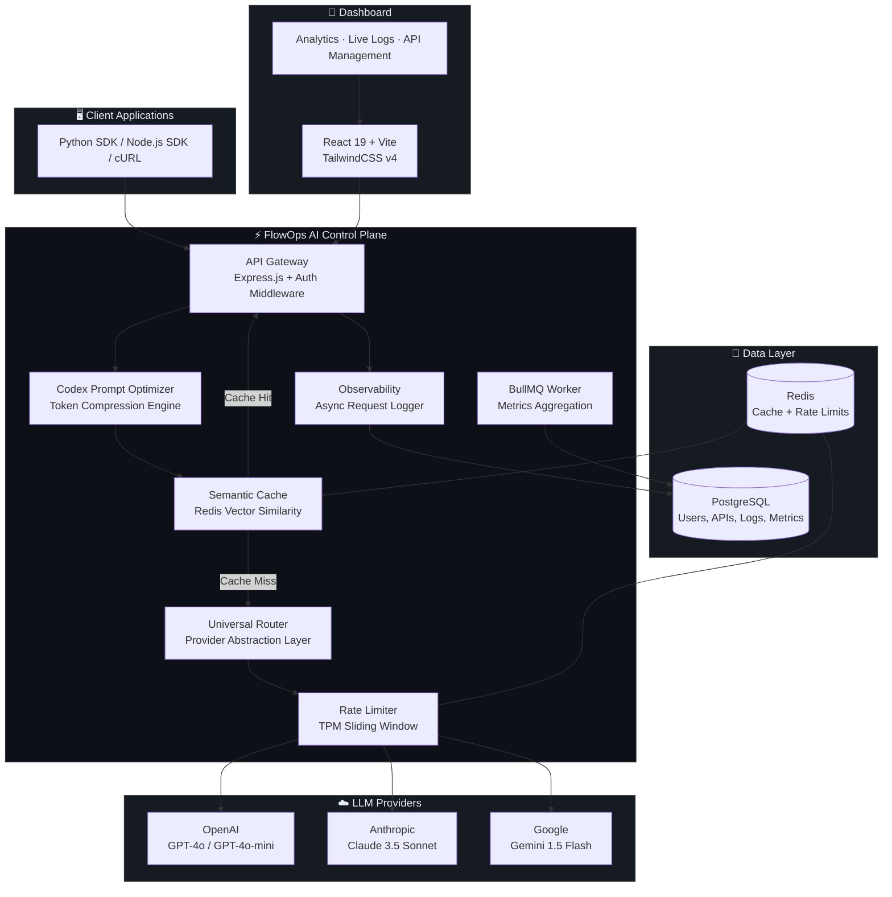

<div align="center">


# FlowOps — The AI Control Plane

**Route prompts. Slash token costs. Ship AI faster.**

[](LICENSE)
[](https://nodejs.org)
[](https://react.dev)
[](https://postgresql.org)
[](https://redis.io)
[](https://docker.com)
[](https://prisma.io)
[](https://openai.com)

---

**FlowOps** is an open-source, production-grade AI gateway that gives teams a unified control plane to route LLM traffic across OpenAI, Anthropic, and Google Gemini — with built-in semantic caching, token-level rate limiting, automatic retries with fallback, and real-time observability.

[Live Demo](#) · [Documentation](#) · [Report Bug](https://github.com/aaryan-paliwal/flowops-ai-gateway/issues) · [Request Feature](https://github.com/aaryan-paliwal/flowops-ai-gateway/issues)

</div>

---

## ⚡ Why FlowOps?

| Problem | FlowOps Solution |
|---|---|
| 🔀 Managing multiple LLM providers is painful | **Universal Router** — Single endpoint, any model, any provider |
| 💸 Token costs spiral out of control | **Semantic Caching** — Identical prompts skip the LLM entirely (< 20ms) |
| 🔥 No visibility into AI spend & latency | **Real-time Analytics** — Token velocity, cost tracking, latency P50/P95/P99 |
| 💀 One provider goes down, your app breaks | **Smart Fallback** — Automatic retry with weighted load balancing across providers |
| 🚫 No way to throttle abusive API consumers | **TPM Rate Limiting** — Token-per-minute sliding windows per subscription tier |
| 🔑 API key management is a mess | **Key Vault** — Generate, rotate, and revoke scoped keys with one click |
| 🧠 Prompts are verbose and waste tokens | **Codex Prompt Optimizer** — AI-powered prompt compression before routing |

---

## 🏗️ Architecture



---

## 🛠️ Tech Stack

| Layer | Technology |
|---|---|
| **Backend** | Node.js, Express.js, Prisma ORM |
| **Frontend** | React 19, Vite, TailwindCSS v4, Recharts, Zustand |
| **Database** | PostgreSQL 15 |
| **Cache & Queue** | Redis 7, BullMQ |
| **AI Integration** | OpenAI API (GPT-4o, Codex), Anthropic API, Google Gemini API |
| **Auth** | JWT (bcryptjs + jsonwebtoken) |
| **Infra** | Docker Compose, Winston Logging |
| **Validation** | Zod Schema Validation |

---

## 📁 Project Structure

```
flowops/
├── backend/
│   ├── prisma/                 # Database schema & migrations
│   │   └── schema.prisma       # 6 models: User, Api, ApiKey, RequestLog, RateLimit, ApiMetrics
│   └── src/
│       ├── config/             # Database & Redis connections
│       ├── gateway/            # ⚡ Core AI Gateway Engine
│       │   ├── core/
│       │   │   ├── universalRouter.js    # Multi-provider proxy (OpenAI/Anthropic/Gemini)
│       │   │   ├── tokenCounter.js       # tiktoken-based token metering
│       │   │   ├── observability.js      # Async request logging via BullMQ
│       │   │   └── alerts.js             # Slack/webhook alert engine
│       │   ├── gateway.routes.js         # SaaS gateway endpoint (/v1/chat/completions)
│       │   ├── gateway.middleware.js     # Semantic cache + TPM rate limiter
│       │   └── gateway.proxy.js          # Legacy proxy handler
│       ├── middleware/         # Auth, error handling, validation
│       ├── modules/            # User, API, Analytics REST modules
│       ├── routes/             # Express route aggregator
│       └── utils/              # Logger, API key generator, helpers
├── frontend/
│   └── src/
│       ├── pages/              # Landing, Dashboard, Analytics, LiveLogs, Settings, Auth
│       ├── services/           # Axios API client
│       ├── state/              # Zustand store
│       └── ui/                 # Reusable UI components
├── worker/                     # BullMQ background job processor
├── docker/                     # Docker configs
├── scripts/                    # DB seed & reset scripts
├── docker-compose.yml          # Full-stack orchestration
└── .env.example                # Environment template
```

---

## 🚀 Quick Start

### Prerequisites

- **Node.js** ≥ 18
- **Docker** & **Docker Compose** (recommended)
- **PostgreSQL** 15+ & **Redis** 7+ (if running without Docker)

### Option 1: Docker (Recommended)

```bash
# 1. Clone the repo
git clone https://github.com/aaryan-paliwal/flowops-ai-gateway.git
cd flowops-ai-gateway

# 2. Set up environment variables
cp .env.example .env
# Edit .env with your database credentials and API keys

# 3. Launch the entire stack
docker compose up --build -d

# 4. Run database migrations
docker compose exec backend npx prisma migrate dev

# 5. Open FlowOps
# Frontend:  http://localhost:5173
# Backend:   http://localhost:5000
# API Docs:  http://localhost:5000/api/v1
```

### Option 2: Local Development

```bash
# 1. Clone & install
git clone https://github.com/aaryan-paliwal/flowops-ai-gateway.git
cd flowops-ai-gateway
npm install
cd backend && npm install
cd ../frontend && npm install
cd ../worker && npm install
cd ..

# 2. Configure environment
cp .env.example .env
cp .env.example backend/.env
# Fill in DATABASE_URL, REDIS_URL, JWT_SECRET, OPENAI_API_KEY

# 3. Set up the database
cd backend && npx prisma migrate dev && cd ..

# 4. Start all services concurrently
npm run dev:local

# Frontend → http://localhost:5173
# Backend  → http://localhost:5000
```

### Test the Gateway

```bash
# Send a test prompt through FlowOps
curl -X POST http://localhost:5000/v1/chat/completions \
  -H "Authorization: Bearer mock-key" \
  -H "Content-Type: application/json" \
  -d '{
    "model": "gemini-1.5-flash",
    "messages": [{"role": "user", "content": "Hello, FlowOps!"}]
  }'
```

---

## 📸 Screenshots

> Screenshots will be added as features are built. Stay tuned!

| Dashboard | Analytics | Live Logs |
|---|---|---|
| *Coming soon* | *Coming soon* | *Coming soon* |

---

## 🔑 Core Features

### 🔀 Universal LLM Router
Single `/v1/chat/completions` endpoint that routes to OpenAI, Anthropic, or Gemini based on the model parameter. Zero code changes needed — just swap the model string.

### 🧠 Semantic Caching
Redis-powered similarity-based caching. If a prompt is semantically identical to a previous one (≥90% similarity), the cached response is returned in **< 20ms** — saving 100% of token cost.

### ⚡ Token-Per-Minute Rate Limiting
Sliding window rate limiter that enforces TPM budgets per subscription tier (FREE / PRO / MAX). Prevents cost overruns and protects upstream providers.

### 🔄 Smart Retry + Fallback
If the primary provider fails, FlowOps automatically retries with exponential backoff and falls back to the next provider in the chain. Weighted load balancing distributes traffic optimally.

### 📊 Real-Time Analytics Dashboard
Six analytics subtabs: Overview, Token Usage, Latency (P50/P95/P99), Error Analysis, Cost Tracking, and Cache Performance. All powered by PostgreSQL aggregation and Recharts.

### 🔐 API Key Management
Generate, name, rotate, and revoke API keys with a single click. Keys are SHA-256 hashed at rest. Only the first 8 characters are stored for display.

### 🧬 Codex Prompt Optimizer *(Coming Soon)*
AI-powered prompt compression using OpenAI Codex. Automatically rewrites verbose prompts to be concise while preserving intent — reducing token costs by up to 40%.

---

## 🗺️ Roadmap

- [x] Multi-provider universal router (OpenAI, Anthropic, Gemini)
- [x] Semantic caching with Redis
- [x] Token-per-minute rate limiting (SaaS tiers)
- [x] Smart retry + weighted fallback
- [x] Real-time analytics dashboard
- [x] API key management & rotation
- [x] Async observability logging (BullMQ)
- [x] Docker Compose full-stack deployment
- [ ] Codex-powered prompt optimizer
- [ ] Webhook & Slack alerting
- [ ] Team collaboration & RBAC
- [ ] SDK packages (Python, Node.js)
- [ ] Edge deployment (Cloudflare Workers)

---

## 🤝 Contributing

Contributions are welcome! Please read our [Contributing Guide](CONTRIBUTING.md) for details on our code of conduct and the process for submitting pull requests.

---

## 📄 License

This project is licensed under the MIT License — see the [LICENSE](LICENSE) file for details.

---

## 🙏 Acknowledgments

- Built for the [OpenAI × Outskill AI Builders Hackathon](https://outskill.com)
- Inspired by [Portkey](https://portkey.ai), [Helicone](https://helicone.ai), and [LiteLLM](https://litellm.ai)

---

<div align="center">

**Built with ❤️ by [Aaryan Paliwal](https://github.com/aaryan-paliwal)**

⭐ Star this repo if FlowOps helped you ship AI faster!

</div>
